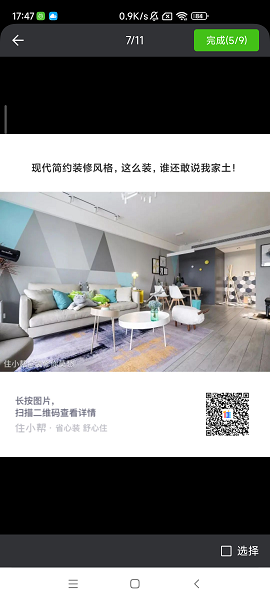

# ImgCache
轻量级超好用的图片缓存框架。
异步加载机制，丝滑流畅，超棒的体验。


### 1、延迟加载一定尺寸大小的图片，避免加载多张大图导致内存溢出
```
recyclerView.setAnticipatedImgSize("width", 60, 80, getResources().getDisplayMetrics().widthPixels / column);
recyclerView.setLazyLoader(new ILazyLoader() {
            @Override
            public void lazyLoad(int position, RecyclerView.ViewHolder holder, int anticipatedImgWidth, int anticipatedImgHeight) {
                NetImgAdapter.IViewHolder mHolder = (NetImgAdapter.IViewHolder) holder;
                ImgCacheExecutor.with("ImgActivity")
                        .netSource()
                        .loadFromMemoryCache(true)
                        .loadFromDiskCache(true)
                        .url(netImgAdapter.getUrls().get(position))
                        .size(anticipatedImgWidth, anticipatedImgHeight)
                        .into(mHolder.ivImg);
            }
        });
```

### 2、加载首页图片
```
        List<String> urls = new ArrayList<>();
        urls.add("https://t7.baidu.com/it/u=1819248061,230866778&fm=193&f=GIF");
        urls.add("https://t7.baidu.com/it/u=737555197,308540855&fm=193&f=GIF");
        urls.add("https://t7.baidu.com/it/u=1297102096,3476971300&fm=193&f=GIF");
        urls.add("https://t7.baidu.com/it/u=2783075563,3362558456&fm=193&f=GIF");
        urls.add("https://t7.baidu.com/it/u=963301259,1982396977&fm=193&f=GIF");
        urls.add("https://t7.baidu.com/it/u=852388090,130270862&fm=193&f=GIF");
        urls.add("https://t7.baidu.com/it/u=2291349828,4144427007&fm=193&f=GIF");
        urls.add("https://t7.baidu.com/it/u=4240641596,3235181048&fm=193&f=GIF");
        urls.add("https://t7.baidu.com/it/u=3652245443,3894439772&fm=193&f=GIF");
        urls.add("https://t7.baidu.com/it/u=12235476,3874255656&fm=193&f=GIF");
        urls.add("https://t7.baidu.com/it/u=3203007717,1062852813&fm=193&f=GIF");
        urls.add("https://t7.baidu.com/it/u=810585695,3039658333&fm=193&f=GIF");
        urls.add("https://t7.baidu.com/it/u=3195384123,421318755&fm=193&f=GIF");
        urls.add("https://t7.baidu.com/it/u=1728637936,3151165212&fm=193&f=GIF");
        urls.add("https://t7.baidu.com/it/u=2671101745,1413589787&fm=193&f=GIF");
        urls.add("https://t7.baidu.com/it/u=2487536464,3153080617&fm=193&f=GIF");
        urls.add("https://t7.baidu.com/it/u=2605426091,1199286953&fm=193&f=GIF");
        urls.add("https://t7.baidu.com/it/u=1620952818,4218424235&fm=193&f=GIF");
        urls.add("https://t7.baidu.com/it/u=805456074,3405546217&fm=193&f=GIF");
        urls.add("https://t7.baidu.com/it/u=3902551096,3717324701&fm=193&f=GIF");
        urls.add("https://t7.baidu.com/it/u=4188671375,2323574798&fm=193&f=GIF");
        netImgAdapter.setUrls(urls);
        recyclerView.loadImgDelay(300);
```

# SimpleRefreshLayout
下拉刷新，上滑加载更多。
参考 [SimpleRefreshLayout](https://github.com/dengzq/SimpleRefreshLayout) 进一步优化完善。

### 1、布局
```
<?xml version="1.0" encoding="utf-8"?>
<jsc.org.lib.img.refreshlayout.SimpleRefreshLayout xmlns:android="http://schemas.android.com/apk/res/android"
    android:id="@+id/srl_list_container"
    android:layout_width="match_parent"
    android:layout_height="match_parent">

    <jsc.org.lib.img.LazilyLoadableRecyclerView
        android:id="@+id/recycler_view"
        android:layout_width="match_parent"
        android:layout_height="match_parent" />

</jsc.org.lib.img.refreshlayout.SimpleRefreshLayout>
```

### 2、示例
```
        SimpleRefreshLayout refreshLayout;
        refreshLayout.setScrollEnable(true);
        refreshLayout.setPullUpEnable(true);
        refreshLayout.setPullDownEnable(true);
        refreshLayout.setHeaderView(new SimpleRefreshView(this));
        refreshLayout.setFooterView(new SimpleLoadMoreView(this));
        refreshLayout.setBottomView(new SimpleBottomView(this));
        refreshLayout.setOnSimpleRefreshListener(new SimpleRefreshLayout.OnSimpleRefreshListener() {
            @Override
            public void onRefresh(SimpleRefreshLayout refreshLayout) {
                mHandler.postDelayed(new Runnable() {
                    @Override
                    public void run() {
                        refreshData();
                        refreshLayout.refreshComplete();
                        recyclerView.loadImgDelay(500);
                    }
                }, 2000);
            }

            @Override
            public void onLoadMore(SimpleRefreshLayout refreshLayout) {
                mHandler.postDelayed(new Runnable() {
                    @Override
                    public void run() {
                        loadMoreData();
                        refreshLayout.loadMoreComplete();
                        refreshLayout.setNoMore(true);
                        recyclerView.loadImgDelay(500);
                    }
                }, 2000);
            }
        });
```

# ImageSelector
多图选择器。参考 [ImageSelector](https://github.com/ioneday/ImageSelector) 进一步优化完善。




### 1、注册activity
```
        <activity android:name="jsc.org.lib.img.selector.activity.ImageSelectorActivity"/>
        <activity android:name="jsc.org.lib.img.selector.activity.ImagePreviewActivity"/>
        <activity android:name="jsc.org.lib.img.selector.activity.ImageCropActivity"/>
```

### 1、调用activity
```
        ActivityResultLauncher<Intent> mSelectImagesLauncher = null;
        mSelectImagesLauncher = registerForActivityResult(new ActivityResultContracts.StartActivityForResult(), new ActivityResultCallback<ActivityResult>() {
            @Override
            public void onActivityResult(ActivityResult result) {
                if (result.getResultCode() == RESULT_OK) {
                    List<String> paths = result.getData().getStringArrayListExtra(ImageSelectorActivity.OUTPUT_DATA);
                }
            }
        });
        
选择多图        
mSelectImagesLauncher.launch(ImageSelectorActivity.createMultipleIntent(v.getContext(), 9));

选择单图        
mSelectImagesLauncher.launch(ImageSelectorActivity.createSingleIntent(v.getContext(), 9));

```

# 联系我
添加微信，请备注"图片缓存框架"
